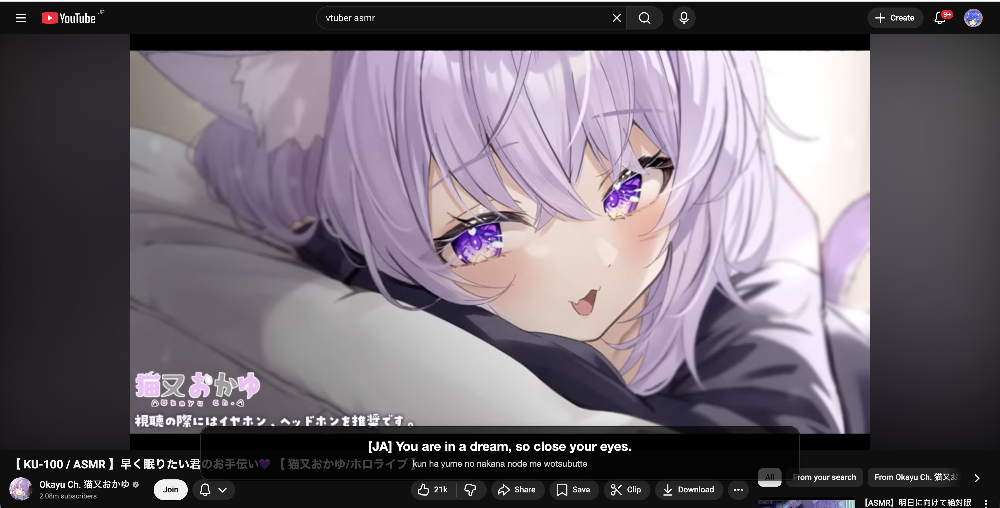

# Livestream Translator

Ever wanted to know what your fav vtubers were saying? Well with the power AI we can now do live translation~!

Example (isn't a livestream but works for normal vids too. technically anything that has audio output from your speakers):
 

Real-time desktop audio translator overlay. Captures system audio, transcribes/translates it using Faster-Whisper, and displays English subtitles in a transparent always-on-top window. Includes romaji output for Japanese source audio.

This uses your local machine to run its models so if your laptop or pc is crappy too bad. Also this is just for mac for now. Or at least optimized for it didn't test other OSs.

## Architecture

```
┌──────────────┐     Queue    ┌──────────────┐   signal    ┌──────────────┐
│ audio_stream │ ──────────▶  │  translator  │ ──────────▶ │  overlay_ui  │
│   (thread)   │  float32 PCM │   (thread)   │  text+romaji│  (Qt main)   │
└──────────────┘              └──────────────┘             └──────────────┘
  SoundCard +                   Faster-Whisper               PyQt6 frameless
  Silero VAD                    task="translate"             transparent window
```

## Prerequisites

### 1. Python 3.10+

### 2. BlackHole virtual audio driver (macOS)

BlackHole creates a virtual loopback audio device so Python can capture "what you hear" from your speakers.

```bash
brew install blackhole-2ch
```

After installing, set up a **Multi-Output Device** in macOS so audio goes to both your speakers and BlackHole:

1. Open **Audio MIDI Setup** (`/Applications/Utilities/Audio MIDI Setup.app`)
2. Click **+** → **Create Multi-Output Device**
3. Check both your speakers/headphones **and** `BlackHole 2ch`
4. Right-click the new device → **Use This Device For Sound Output**

Now your system audio plays through both your headphones and the virtual BlackHole device that the app captures from.

## Installation

```bash
# Clone / cd into the project
cd livestream-translator

# Create a virtual environment
python3 -m venv .venv
source .venv/bin/activate

# Install dependencies
pip install -r requirements.txt
```

> **Note:** The first run will download the Whisper model (~500 MB for `small`) and the Silero VAD model.

## Usage

```bash
# Basic – auto-detects BlackHole device
python main.py

# Specify model size (tiny/base/small/medium/large-v2/large-v3)
python main.py --model base

# Use GPU if available (NVIDIA CUDA only)
python main.py --device cuda --compute-type float16

# Specify the audio device keyword
python main.py --device-keyword "blackhole"

# List available audio devices
python main.py --list-devices

# Adjust VAD sensitivity (lower = more sensitive, default 0.35)
python main.py --vad-threshold 0.25

# Force source language to japanese for example
python main.py --source-language ja

# Longer chunks (more context, higher latency)
python main.py --max-chunk-sec 12

# Increase CPU threads for Whisper
python main.py --cpu-threads 8

# My preferred command for vtubers (cuz they speak hella fast)
python main.py --cpu-threads 12 --vad-threshold 0.2 --source-language ja --model small --min-chunk-sec 1 --max-chunk-sec 12
```

### Command-line Options

| Flag                    | Default  | Description                                                |
|-------------------------|----------|------------------------------------------------------------|
| `--model`               | `small`  | Whisper model size (`tiny`, `base`, `small`, etc.)          |
| `--compute-type`        | `int8`   | Quantization: `int8`, `float16`, `float32`                 |
| `--device`              | `cpu`    | Device backend (`cpu`, `cuda`, `auto`)                     |
| `--cpu-threads`         | `4`      | CPU threads for Whisper                                    |
| `--device-keyword`      | auto     | Keyword to match audio device (e.g. `blackhole`)           |
| `--vad-threshold`       | `0.35`   | Silero VAD speech probability threshold                    |
| `--min-chunk-sec`       | `0.6`    | Minimum final speech chunk length in seconds               |
| `--max-chunk-sec`       | `10.0`   | Maximum speech chunk length in seconds                     |
| `--list-devices`        |          | Print audio devices and exit                               |
| `--source-language`     |          | language to translate from default is auto detect          |

## How It Works

1. **Audio Capture** (`audio_stream.py`): SoundCard records from the BlackHole virtual device at 16 kHz mono. Each 30 ms frame is passed through Silero VAD.

2. **Voice Activity Detection**: Only speech segments are buffered. When 600 ms of silence is detected (or the max buffer of 10s is reached), the accumulated audio is pushed to a queue.

3. **Translation** (`translator.py`): A background thread pulls audio chunks from the queue and runs Faster-Whisper with `task="translate"` to produce English text. If the detected language is Japanese, a second pass generates the original Japanese text which is then converted to romaji via pykakasi.

4. **Overlay** (`overlay_ui.py`): A transparent, frameless PyQt6 window at the bottom of the screen displays the translated text. It fades out after 8 seconds of inactivity. Text updates are thread-safe via Qt signals.

## File Structure

```
livestream-translator/
├── main.py            # Orchestrates threads and data flow
├── audio_stream.py    # Audio capture + VAD
├── translator.py      # Faster-Whisper inference + romaji
├── overlay_ui.py      # Transparent subtitle overlay
├── requirements.txt   # Python dependencies
└── README.md          # This file
```

## Troubleshooting

- **No audio captured**: Make sure BlackHole is installed and your system output is set to the Multi-Output Device. Run `python main.py --list-devices` to verify BlackHole appears.
- **High latency**: Try `--model tiny` or `--model base` for faster inference at the cost of accuracy.
- **VAD too aggressive**: Lower `--vad-threshold` to 0.2 or 0.15.
- **VAD not filtering enough**: Raise `--vad-threshold` to 0.5+.
- **macOS permission prompt**: Grant microphone access to your terminal/IDE when prompted.
